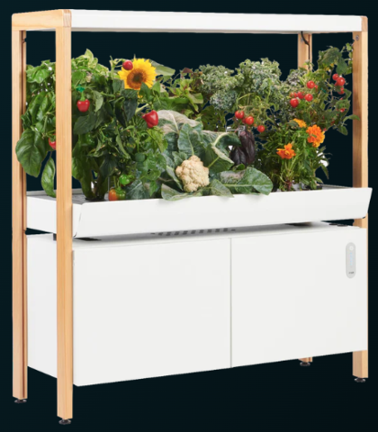

# Growing Food at Home

# Background
55% of American households engage in gardening activities, with 67% of households currently or planning on growing edible plants. [1]. This semester we will be focusing on satisfying the needs of and developing solutions for people who want an easier method of growing food at home. 

## Current Solutions
### Rise Gardens
Description: The product is a modular system that grows food. The product has options to choose from ranging from Level 1 to Level 3 along with a small personal garden option which holds 4 to 12 plants. With the product they have created an app that shows the water levels in the plant, light level, time before harvesting and time before maintenance, the app also provides timely notifications about the plant.
Pros:
- Provides a community to learn from.
- Options to choose from.
- Notifications are provided.
- Has Hydroponics
Cons:
- Dimensions of the product are big, hence not feasible for people with small houses.
- Different type of food require different option, like fruits require the large roma option which can fit only 1 to 3 plants.
- The cost of the product is very expensive with price ranging from  $349 to $1299

# Need Identification
## Need Statement
Urban and suburban home cooks need cheaper access to quality ingredients.

## Target User Group
People living in cities of all sizes who currently cook, but currently do not garden at home.
## User's Point of View

# Design Criteria
## Critical Criteria
## Secondary Criteria

## Sources
[1] [ K. Mayers, “Gardening statistics in 2024 (incl.. Covid & Millennials),” Garden Pals, (accessed Jan. 26, 2024).](Sources/GardenPals.pdf)
